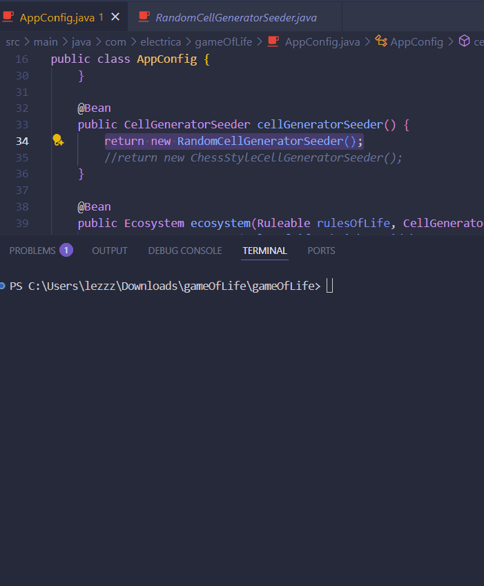

# Game of Life

Este proyecto es una implementación del **Juego de la Vida** de Conway en Java, utilizando principios de arquitectura limpia y Spring para la configuración.

## Características

- **Reglas clásicas de Conway**: Soporta las reglas estándar del Juego de la Vida, con la adición de un estado "Newborn" para células recién nacidas.
- **Arquitectura limpia**: Separación clara entre lógica de dominio, presentación y configuración.
- **Patrones de generación**: Puedes elegir entre diferentes generadores de patrones de células (aleatorio, tablero de ajedrez, etc.).
- **Configuración flexible**: Tamaño del tablero y velocidad de refresco configurables mediante propiedades de Spring.

## Ejemplos visuales

A continuación puedes ver algunos ejemplos de funcionamiento del juego:




> _Coloca aquí tus GIFs en la carpeta `docs` y nómbralos como `example1.gif`, `example2.gif`, etc. Puedes cambiar los nombres según corresponda._

## Estructura del proyecto

```
src/
 └── main/
     └── java/
         └── com/
             └── electrica/
                 └── gameOfLife/
                     ├── AppConfig.java
                     ├── models/
                     │   ├── Ecosystem.java
                     │   ├── RulesOfLife.java
                     │   └── ...
                     ├── cellGeneratorSeeder/
                     │   ├── RandomCellGeneratorSeeder.java
                     │   ├── ChessStyleCellGeneratorSeeder.java
                     │   └── ...
                     ├── contracts/
                     └── ui/
                         └── GameUI.java
docs/
 ├── ChessGrid.gif
 ├── RandomGrid.gif
 └── example3.gif
```

## Uso

1. **Configura los parámetros** en `application.properties` o directamente en `AppConfig.java`:
    - `spring.aplication.height`: Altura del tablero (por defecto 20)
    - `spring.aplication.width`: Ancho del tablero (por defecto 20)
    - `spring.aplication.speed`: Velocidad de refresco en milisegundos (por defecto 1000)

2. **Selecciona el generador de células** en `AppConfig.java`:
    ```java
    @Bean
    public CellGeneratorSeeder cellGeneratorSeeder() {
        // return new RandomCellGeneratorSeeder();
        return new ChessStyleCellGeneratorSeeder();
    }
    ```

3. **Ejecuta la aplicación** desde tu IDE o usando Maven/Gradle.

## Personalización

- **Agrega nuevos patrones**: Implementa la interfaz `CellGeneratorSeeder` para crear tus propios patrones iniciales.
- **Modifica las reglas**: Cambia la lógica en `RulesOfLife.java` para experimentar con nuevas reglas de evolución.

## Problemas comunes

- **Caracteres extraños en consola**: Si ves caracteres como `Ôüé`, revisa el método de impresión en `GameUI` y asegúrate de usar caracteres compatibles con tu terminal (por ejemplo, `O` para vivo y `.` para muerto).
- **Configuración de codificación**: Asegúrate de que tu consola/IDE use UTF-8 si usas caracteres especiales.

## Créditos

Desarrollado por Andres Fernandez 
Inspirado en el Juego de la Vida de John Conway.
